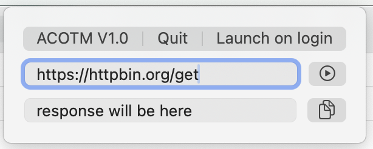

# MenuBarApiCaller

This is a simple app which lives in the menu bar on macOS, it allows you to simply input an url and get the response like from an Api or something else.

## Installation

### macOS version

This requires macOS 13.0 or later because of the LaunchAtLogin-package.

### Build from source
After cloning or downloading the source, you need to change the app's `PRODUCT_BUNDLE_IDENTIFIER`, `CODE_SIGN_IDENTITY` and `DEVELOPMENT_TEAM` to your personal apple dev account settings.

## Usage

- Main:
    1. Open GitHub-Repository
    2. Enable/Disable launch at login, made easy by [sindresorhus's LaunchAtLogin](https://github.com/sindresorhus/LaunchAtLogin-modern)
    3. And simply quit the app

- Calling:
    - Upper text field: input for url to process
    - Upper button (play): to call the url

- Copying:
    - Lower text field: small response field
    - Lower button (copy): to copy the response to the clipboard

## License

**License:** GNU General Public License v3.0

[GPL 3.0](https://choosealicense.com/licenses/gpl-3.0/)